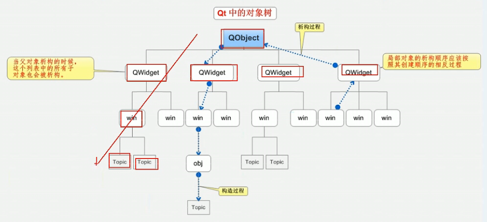

## Qt概述

### 什么是Qt

Qt是一个跨平台的C++图形用户界面应用程序框架。他为开发者提供建立图形界面所需的所有功能，它是完全面向对象的且很容易拓展，并支持真正的组件编程

### 优点

- 跨平台
- 接口简单，易上手
- 一定程度上简化了内存回收

创建第一个Qt程序

1. 点击创建项目后，选择项目路径并给项目起名称
   - 注意名称中不能有中文和空格
   - 注意路径中不能有中文路径
2. 选择基类
   - 基类有三种
     1. `QWidget`窗口类，是最简单的窗口
     2. `QMainWindow`，该类是`QWidget`的子类，多出了菜单栏、状态栏
     3. `QDialog`，该类是`QWidget`的子类，是一个对话框类
3. main函数
   - `<QApplication>`是Qt提供的一个应用程序类的头文件
   - `QApplication a // 创建一个Qt应用程序对象a，在Qt中，应用程序对象有且仅有一个`
   - `myWidget w;    // 实例化窗口对象，注意这里的myWidge是在第二部中所创建的类的名字`
   - `w.show();      // 调用show函数以顶层方式显示窗口`
   - `return a.exec();	// 让应用程序对象进入消息循环，代码阻塞到当前行`

### Qt中的工程文件

Qt中的工程文件可以使用qmake或者cmake进行配置

### Qt对象树

在创建和删除的时候会按照对象树的顺序依次进行




### 信号和槽

连接函数：`connect(信号的发送者,发送的具体信号,信号的接受者,信号的处理);`

> 信号的处理就是槽函数

信号槽的优点：耦合松散，信号发送端和接收端本身是没有关联的，通过connect()才将两端耦合在一起

- 样例

点击我的按钮关闭窗口

```
connect(mybtn, &QPushbutton::clicked,this,&myWideget::close)
```

