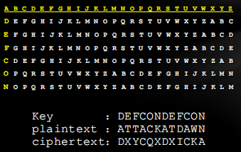
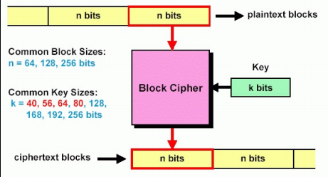
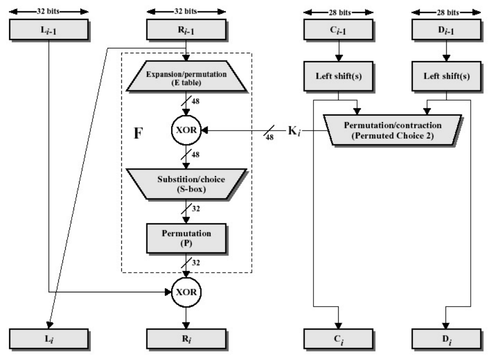
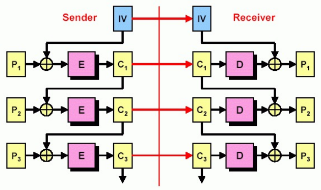
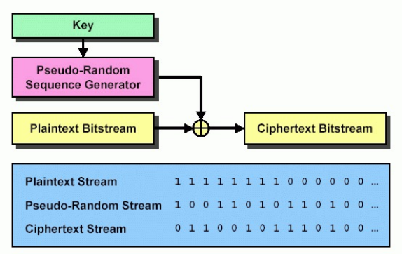
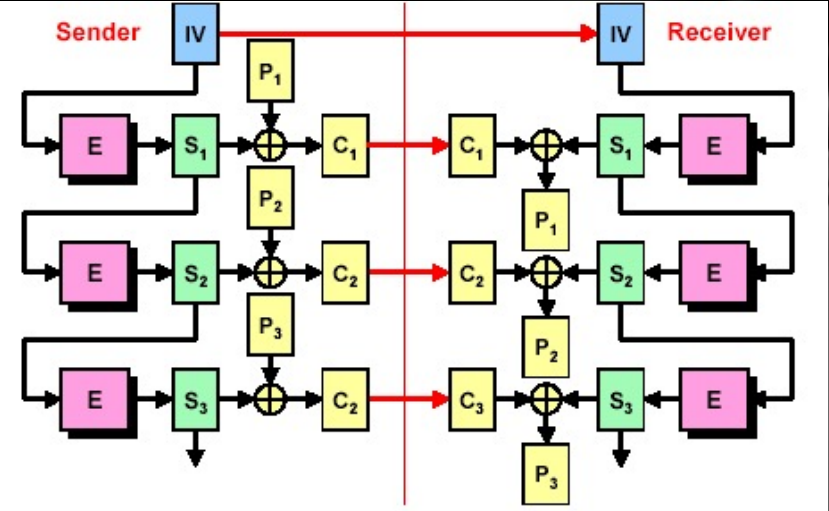
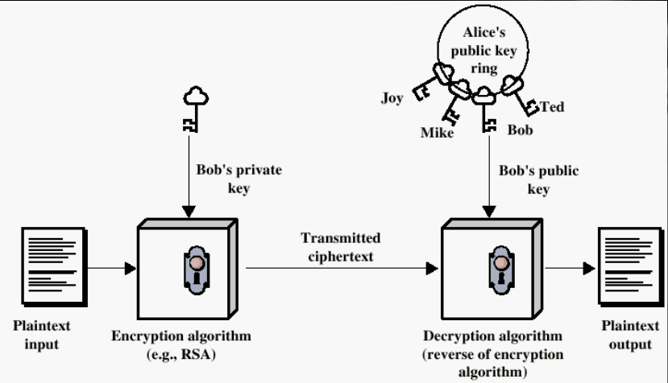
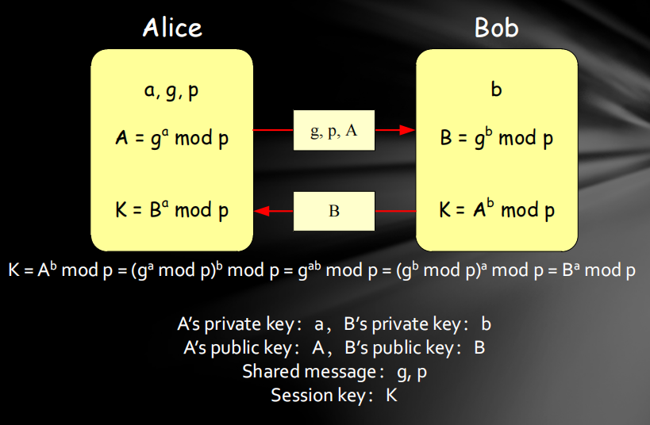

## 计算机安全

目前密码学一共有四次革命，第四次革命正在进行

1. 第一次革命：Kerckhoffs' Principle
2. 第二次革命：Computers
3. 第三次革命：Public key ciphers
4. 第四次革命：网络？移动网络

### `Kerckhoffs` 原则

> 密码系统应该是安全的，即使该系统的所有内容（除了密钥）都是公共知识

Kerckhoffs' Principle标志着密码学从史前阶段发展到了经典阶段，即密码学从经验发展到了科学

- 增强安全性：假设任何不变的内容都会被披露
  - 没有理由认为加密算法本身能够保密
  - 安全依赖于密钥(key)的保密而不依赖于算法的保密，密码的强度必须在对手已知算法的前提下定义

### 密码学 4 要素

- **Confidentiality** 保密性-对信息和资源的隐藏
  - 访问控制机制
- **Integrity** 完整性-数据是否会被非法篡改
  - 预防机制和检测机制
  - 数据完整性和来源完整性
- **Availability** 可用性-资源能否访问

第四要素：真实性/不可否认性（Authenticity / Non-repudiation）

真实性是确保消息、交易或其他信息交换来自其声称的来源。真实性包括身份证明。

不可否认性意味着一个人履行合同义务的意图。它还意味着交易的一方不能否认已收到交易，另一方也不能否认已发送交易

### 计算机安全的概念

​		Asset + Threat + Vulnerability = Risk

​						A + T + V = R

漏洞(vulnerabilities)、威胁(threats)、攻击(attacks)和控制(control)

- 漏洞(vulnerabilities)
  - 安全系统的弱点
- 威胁(threats)
  - 是可能(has the potential to)造成伤害损失的一系列情况(set of circumstances)
- 攻击(attacks)
  - 一个人或另一个系统能利用(exploit)漏洞发起(initiates)进攻
- 控制(control)
  - 是用于去除或减少漏洞的一种行为、驱动、过程或技术

### 安全攻击方式（记一下四种攻击方式的图）

##### 四种攻击方式

###### Interruption（阻断）

此类攻击使系统的资产被破坏，无法访问或者不可用

攻击的是Availability

此类攻击能够被我们容易地察觉到

-  阻断的方式

1. 硬件攻击
2. 攻击物理链路
3. 引入噪声
4. 删除进程
5. 移除程序或文件
6. 拒绝服务攻击（DOS）

######  Interception（拦截）

拦截攻击指未经授权的部分获得访问资产的权限

攻击的是Confidentiality

此类攻击很难被检测到

- 拦截攻击的方式

1. 窃听（wiretap/Eavasdropping）
2. 链接监视器
3. 捕获包
4. 系统黑客攻击

> 拦截攻击无法被完全避免

###### Modification（修改）

修改指未经授权的部分获得访问以及篡改资产的权利

攻击Integrity

能够利用**数字水印和其他技术**防止此类攻击

- 修改的方式

1. 修改数据库中的记录
2. 系统黑客
3. 通信延迟
4. 修改硬件

###### Fabrication（伪造）

未经授权的一方将假对象插入系统，并假装它是由经授权的一方发送的

攻击的是Authenticity

- Fabrication的方式

1. 在数据库中插入记录
2. 插入数据包(假IP地址)
3. 用伪造电子邮件或网络地址钓鱼

##### 被动攻击和主动攻击

4种攻击方式细分可分为被动（Passive Attacks）攻击和主动攻击（Active Attacks）

- 被动攻击：Interception
  - 难以被检测，因此预防是比检测更有效的
- 主动攻击：Interruption、Modification、Fabrication
  - 很容易检测但难以预防，能够在被攻击后快速恢复（resume）

## 密码学

### 密码学基础

- 密码学的概念
  - Plaintext(明文，P)
  - Ciphertext(密文，C） 
  - Encryption(加密方法，E() ） 
  - Decryption(解密方法，D() ） 
  - Key（钥匙，K） 
  - C = E~K~(P)
  - P = D~K~(C)


### 经典密码的原则和破解

- 经典密码都是基于置换(substitution)或位移(transposition)生成的密码

- 凯撒密码

  - 明文中的每个字母都被其右移k位后的字母所取代

    例如位移三位时：A->D，B->E，...

- 玛丽女王密码

  - 加密方式：23个符号表示字母，35个符号表示单词，包括4个空值和一个双连字符
  - 破译方式：频率分析法

- vigenere Square

  - 加密方式

    - 将26个字符作为一个圆圈，并用转换行加密单个字符

      之后指定一个offset keyword来加密每一行

      > 即对于每一行，根据当前行的key将26个字母左移`key-1`的位数
      >
      > 例如，某一行的key是A，则将字母表左移0位

      例如：使用“DEFCON”，我们可以得到加密表如下

      

  - 破解方式

    1. 位移法求解key的长度
       1. 进行若干次位移，每次位移后计算与原密文对应相同的字母个数
       2. 找到重复字母数较高的几次位移，求取他们的公因数

    2. 对求出的公因数进行频率分析，尝试破解

- book cipher

  - 用书作为密码本进行加密的方式

- 频率分析法

  - 即将密文中最常出现的字符或字符串与单词中最常用的单词或字母进行匹配尝试破解

- kasiski Test

  - 定义：若用给定的m个密钥表周期地对明文字母加密，则当明文中有两个相同字母组在明文序列中间隔的字母数为m的倍数时，则这两个明文字母组对应的密文字母组必相同。
    若密文中出现两个相同的字母组，他们所对应的明文字母组未必相同，但相应的可能性很大。

- Enigma原理

  - ###### rotor

    一个转子定义了一个周期为26的多字母替换密码

    一个有n个轮子的转子机可以定义一个周期为 26^n^ 的替换密码

    ###### placement

    一个有n个轮子的转子机有`n!`种放置位置

    ###### plugin board

    插头版的作用是让操作员可以交换6对字母

    例如：如果A连接到B，则按A键得到B，反之亦然

    `n pairs`的插头板的计算公式为`C(26,n)*C(n,2)/2`

    ###### rotor machine的key空间

    ```
    rotor的周期*placement*plugin board
    ```


  > Enigma不考结构，但是需要大概了解它是什么

### 对称密码学

#### 对称密钥算法

Symmetric Key Ciphers（对称密钥加密算法），也被称为Shared Key Ciphers（共享密钥加密算法）或Secure Key Ciphers(保密密钥加密算法）

对称密钥算法是密码学中的一种加密算法。

它的加密算法是一个对抗函数，所以解密算法与加密算法相同，即用相同的加密算法，我们可以得到明文。

换句话说，有了正确的密钥，两个加密就可以获得原始消息。（这在数学上被称为退化）

在应用中，它意味着加密和解密使用相同的密钥，或者可以轻松地计算其他密钥

对称密钥算法符合克霍夫的原则

#### Block Cipher

块密码将输入位流划分为n位节，只对该节进行加密，节之间没有依赖关系/历史记录



在一个好的块密码中，每个输出位是所有n个输入位和所有k个键位的函数

##### Feistel Cipher Structure

几乎所有的现代对称加密算法都是基于这种结构的

> 提出背景：如果采用理想的块密码（即完全随机映射），可能会导致密钥长度过长(n*2^n^，n=64，需要2^70^位的密钥长度，因此需要一个合适的方式去处理块密码

设计：费斯特尔利用产品密码的概念来解决这个问题，通过两种方法来引起雪崩效应：

- 扩散
  - 使得密⽂的统计特性与明⽂之间的关系尽量复杂
- 扰乱
  - 使得密⽂的统计特性与加密密钥之间的关系尽量复杂

##### Feistel cipher encryption & decryption process

- 扩散
  - 迭代交换左右半部分
- 混淆
  - 圆函数F

- Block Size
  - 更大的块大小意味着更大的安全性，典型的大小是64位或128位

- Key Length
  - 更大的密钥大小意味着更大的安全性，典型的大小是128位
- Number of rounds
  - 更多的轮数意味着更大的安全，典型的大小是16
- Sub-key generation algorithm
  - 该算法的复杂性越大，就会导致密码分析的难度越大
- Round function F
  - 更大的复杂性通常意味着更大的阻力密码分析

##### DES Algorithm

- DES是一种数据加密标准

  - 1977年由国家标准局采用，目前广泛使用，

  - 以64位的块进行加密

  - 使用56位的key

  - 基于Feistel结构

- DES的特点

  - 强雪崩效应

  - 具有较强的抗裂纹强度，只能用蛮力法进行攻击
  - 但是在互联网时代，只有56位的密钥还不够安全

- DES算法的流程


- 单轮DES



- 破解DES算法

DES具有优异的抗裂纹性能，安全了25年，直到1997年才被破解

破解DES算法的方式是暴力枚举所有的密钥空间

- Triple DES

Triple DES是利用加密、解密、加密的方式来完成数据加密，公式如下：

C = E~K3~[D~K2~[E~K1~[P]]]

> C表示密文，P表示明文，E表示加密算法

Triple DES可以直接与DES算法兼容，只需令E~K3~ = E~K2~或 E~K1~ = E~K2~即可

Triple适用于互联网应用程序，例如PGP和S/MIME

##### AES 标准

- 基本内容

  - AES（Advanced Encryption Standard）是在2001年被颁布的新的国际加密标准

  - 采用比利时科学家琼·戴门和文森特提出的Rijndael算法代替DES和3DES，克服了3DES的以下缺点

    - 3DES是通过软件方法实现的，速度较慢的

    - 块的大小只有64位

- AES的特点
  - 块大小：128位
  - 密钥大小：128/192/256位
  - 对所有已知攻击免疫
  - 在每个平台上执行快速和代码紧凑
  - 设计简单

##### Mode of Operation

块密码本身只适用于对一个被称为“块”的固定长度的比特组进行安全的加密转换（加密或解密）

一种Mode of Operation描述了如何重复应用密码的单块操作，以安全地转换大于块的数据量

- Electronic Codebook (ECB)
- Cipher-block chaining (CBC)
- Propagating cipher-block chaining (PCBC)
- Cipher feedback (CFB)
- Output feedback (OFB)
- Counter (CTR)

##### ECB


对于一个长数字序列的块密码

如果一个攻击者认为块C~2~ 对应于 $ amount，则替换另一个 C~k~ (仅密文攻击)

攻击者还可以建立一个小于C~k~的代码本，猜测Pk>pairs（选择明文攻击）。重播攻击？

##### CBC



抑制重放攻击和代码本构建：相同的输入明文P~i~=P~k~不会导致相同的输出代码，因为基于内存的chaining

IV = Initialization Vector – use only once

#### Stream Cipher

与其像块密码那样将比特流划分为离散的块，不如用一个来自伪随机数序列的连续流异或明文的每一位，使用相同的对称键，再次异或去提取明文





#### Key分发问题

- 根据科尔克霍夫斯的原则，key是最重要的
  - 对于对称加密，密钥应该被共享，以及如何共享密钥
- 对于对称加密，密钥分配如下
  - A可以选择一个key并将其物理交付给B
  - 第三方可以选择密钥并将其物理交付给A和B
  - 如果A和B以前和最近使用过一个密钥，一方可以将新密钥传输给另一方，并使用旧密钥进行加密。
  - 如果A和B都与第三方C有加密连接，C可以提供加密链接上的密钥
- 典型的解决方案——密钥分发中心(KDC)

### 非对称密码学

#### 基础

- 公钥密码学是密码学史上最伟大的革命，它可以说是唯一的革命
  - 公钥加密算法依赖于数学函数，而不是替换或换位。

  - 公钥密码学是不对称的，使用两个分离的密钥，也称为“不对称密码学”
- 公钥密码允许交换秘密信息，而不共享发送者和接收者之间的任何秘密信息

  - 解决密钥分发问题

- 公钥密码使发送者和接收者秘密通信彼此保密

  - 解决数字签名问题

#### 公钥密码系统的模型

- for Secrecy


- for Authentication



#### 公钥密码学的要求

- B很容易计算生成一对密钥(公钥KU~b~，私钥KR~b~)
  - 确保密钥生成是容易的
- 发送方A很容易加密计算
- 
  - 确保加密是可以及时接收的
- 接收方B能够简单地解密
  - 确保解密是可接受的时间
- 对于知道公钥KU~b~的攻击者确定私钥KR~b~在计算上是不可行的
- 对于知道公钥KU~b~和密文C的攻击者来说，恢复原始消息M在计算上是不可行的
- 密码对可以交换
  - 确保可以用于加密或签名中

#### 非对称密码学与对称密码学的异同

- 公钥密钥加密算法依赖于数学函数而不依赖于替代和置换
- 公开密钥加密算法是非对称的，使用两个独立的密钥，因此又称为非对称加密算法
- 公钥密码使得发送端和接收端在不共享任何秘密消息（密钥）的前提下即可交换大量秘密信息（实现通信保密）成为可能


#### 公钥密码学的功能

- 加密、签名、密钥交换

#### 单向函数

- DH算法

  - 计算大整数的整数次幂比较容易，但计算离散对数很困难

  - DH规则

    

  - a、b、p一般都会取较大值，因为三者的选择在很大程度上影响了算法的安全性，但g则不需要很大

  - 注意DH算法会被中间人攻击

- **RSA算法**

  - 大素数相乘很容易，但大合数质因子分解很困难
  - RSA算法规则
    - 生成key的要求
      - n = pq, φ(n) = (p-1)(q-1)
        - φ(n)为欧拉函数
      - ed ≡ 1 (mod (p-1)(q-1))
    - 加密
      - c = m^e^ mod n
    - 解密
      - m= c^d^ mod n

- 注意：单向函数不会要求算法推理，但要求会用

#### 对称/非对称密码学的pros/Cons和应用模型

- 对称密钥
  - pros：廉价，快速
    - 廉价的集成电路芯片(IC chips，integrated circuit chips)能被用于加密和解密
  - cons：密钥分发是问题
- 非对称密钥(公钥)
  - pros：密钥分发不是问题
  - Cons：相对昂贵且速度较慢
    - 加密和解密的硬件IC芯片是很昂贵的
- 在应用中
  - 使用公钥密码学(例如RSA)分发密钥
  - 使用对称密码学去加密和解密

## 数字签名

公钥密码学能够很好地支持数字签名

- 数字签名的要求

  - 绑定到被签署的文档上
  - 接受者能验证这个签名，任何其他人不能删除签名
  - 签名者不能否认他们自己的签名
  - 签名必须被第三方加密使得它能够解决纠纷(disputes)
  - 能够验证数据的签名、签名的时间(即消息内容的签名时刻(signature moment))
    - 使签名不能被重复利用
    - 不能被遗忘
    - 不能被改变
    - 与时间进行绑定
- 数字签名的标准
  - DSS/DSA，数字签名标准
- 数字签名的工作流程
  - 加密过程
    - 发送者使用接受者的公钥进行加密
    - 接受者使用他的私钥进行解密
  - 签名过程
    - 发送者使用他的私钥进行签名
    - 接受者用发送者的公钥认证签名
- 为什么数字签名使用单向散列函数？
  - 数字签名需要一个能够代表文档特征的特征值
  - 数字签名不能发生冲突

## 单向哈希函数

- 常用的单向哈希算法
  - MD5
  - SHS

- 单向哈希算法的特点
  - 便于计算
  - 很难反向计算
  - 很难找到冲突

- 单向哈希函数的概念
  - 单向哈希函数的输入用m表示，m可以是字符串或文档
  - 输出用H(m)表示，是一个长度为L的二进制字符串
  - 注意：L的长度在单向哈希算法中是一个定值
    - MD5中L=128，SHA~-1~中，L=160
- 攻击单向哈希函数的方式
  - 穷举
  - 利用哈希冲突进行攻击

## MAC(消息验证码)

- MAC（消息验证码）的概念
  - MAC，Message authentication code，也被称为keyed hash function
  - MAC用于检测信息完整性
- 常见的MAC算法有
  - HMAC
  - CBD-MAC
  - ......
- HMAC
  - HMAC，Hash-based message authentication code，基于哈希的消息认证码
  - HMAC可以使用不同的单向哈希函数进行构造
  - HMAC比单向哈希函数更难发生冲突，因此HMAC-MD5和HMAC-SHA1由于MD5和SHA1的漏洞而没有安全问题
- CBC-MAC
  - CBC-MAC，cipher block chaining message authentication code，密码块链接消息认证代码
- MAC与数字签名的不同
  - MAC是发送者和接受者需要共享一个秘密的key
    - MAC仅能被特定的接受者认证
    - MAC并不提供不可否认性服务：所有可以验证消息机密性的人也可以生成MAC
  - 数字签名不需要共享任何秘密信息
    - 数字签名能够被所有拥有发送者公钥的接收者认证
    - 数字签名具有不可否认性
  - 为什么不总是使用数字签名？
    - MAC比数字签名更快
    - 我们并不总是需要不可否认性

## 认证(Authentication)

- 私人特征
  - 生物特征(biometrics characteristics)
  - 行为特征(behavioral characteristics)
- 基于密码的认证
  - 最广泛使用的方式为采用文件保存被认证的用户及其密码
  - 系统通过检查密码来认证用户的身份
- 字典攻击
  - 字典攻击指的是在破解密码或密钥时，逐一尝试用户自定义词典中的可能密码（单词或短语）的攻击方式
  - 字典攻击与暴力破解的区别是，暴力破解会逐一尝试所有可能的组合密码，而字典式攻击会使用一个预先定义好的单词列表（可能的密码）
- 应对字典攻击的方式
  - 哈希加盐
  - Shadow Password
    - 将散列密码存储在 /etc/shadow 文件中，该文件只能由系统管理员（root）读取
    - 添加密码的到期日期

- 加盐加密
  - 加盐加密是一种对系统登录口令的加密方式，它实现的方式是将每一个口令跟一个n位随机数相关联，这个n位随机数叫做"盐"(salt)
  - 加盐使得即使具有相同密码的用户在密码系统中存储的密码也不相同
  - 需要注意的是字典攻击对于加盐后的密文仍有效
- 加盐的好处
  - 如果没有 salt，攻击者可以对所有密码条目预先计算一次所有字典单词的哈希值，而使用 salt，攻击者必须为每个密码条目计算一次所有字典单词的哈希值，这样极大增加了字典攻击的复杂度
- 生物识别
  - 好处
    - 不能被窃取、丢失或忘记
  - 坏处
    - 设备成本、安装和维护
    - 比较算法的准确性
    - 隐私泄露
- 网络认证
  - 质询-响应身份验证
    - 目标：避免重放攻击
    - 过程：通过加密解密的方式对每一次请求进行质询
  - KERBEROS
    - 目标
      1. 安全性
         - 无法获得足够的信息来伪造其他用户
      2. 可靠性
         - 无法获得 Kerberos 的服务意味着无法获得所需的服务。因此需要高可靠性。
      3. 透明度
         - 用户不必知道身份验证服务的存在。
      4. 可扩展性
         - 系统可支持大量用户和服务器
    - 实现方式
      - 登录时从身份验证服务器(AS)获取ticket，需要访问某个服务时从票证授予服务器(TGS)获取service-ticket，凭借service-ticket访问业务服务器

密码系统不会消失，因为他有其他认证方式所无法取代的好处

## 访问控制

授权(Authorization)和访问控制是几乎相同的

### 安全访问控制的概念

- 三个访问控制要素
  1. Subject
     - 一个能够访问对象(object)的实例，例如用户或应用程序
  2. Object
     - 将被访问的对象，例如文件，程序，数据等
  3. Privilege
     - 客体(subject)能使用对象的方法，例如读写删、处理(execute)、子授权(sublicense)

### DAC、MAC和RBAC的概念和原则

- DAC，自主访问控制(Discretionary Access Control)
  - 特点
    - 根据主体的身份和访问权限做出决策
    - 自主意味着具有一定特权的主体可以自动将其访问权限的子集授予其他主体
  - 访问控制矩阵
    - 访问控制列表：每个对象都添加了一个详细列表，以访问其主题。
    - 功能列表：每个主题都添加了详细列表以访问其对象
- MAC，强制访问控制(Mandatory Access Control)
  - MAC对于每一个主题和客体进行安全分级，常见分为TS(绝密)、S（秘密)、C(机密)、U(无密级)
  - Bell-Lapadula模型：用于确保机密性
    - 简单安全属性(无法向上读取)
      - 主体仅能读取在当前安全级别或者更低级别的客体
    - \* 属性(不能向下写入)
      - 一个主体仅能写入当前安全级别或者更高级别的客体
  - Biba模型：用于确保完整性
    - 该模型与Bell-Lapadula模型相反，无法向下读取，无法向上写入
  - MAC可以避免木马的攻击
    - 即使无法阻止木马的窃取文件，也可以阻止木马修改文件
  - Covert Channel(隐蔽通信)
    - 定义：隐蔽通信是使用系统资源进行通信而不提醒主体的通信
    - Resource Exhaustion Channel
      - 不断请求动态内存直到动态内存池被耗尽为止
    - Load Sensing Channel
      - 利用循环计算消耗计算机负载
  - 应对(cope with)隐蔽通信的方法
    - 在认证后
      - 关闭通信或放慢通信速度
      - 检测试图使用通道的行为
      - 容忍其存在
    - 其他方法
      - 限制共享资源
      - 限制带宽
    - 注意：隐蔽通信无法完全消除！
- RBAC，基于角色的访问控制(Role-based access control)
  - 五大数据要素
    - users
    - roles
    - objects(OBS)
    - operations(OPS)
    - permissions(PRMS)
  - 核心概念
    - Role
      - 由一组用户构成的每个角色都与其相关的权限相互关联，并且属于该角色的用户都有权利对客体进行权限内的操作
      - roles和group的不同
        - role是用户集+权限集
        - group仅仅只是用户集
    - Relationship
      - 多对多，用户被分配了确定的角色，角色被分配了确定的权限
    - Sessions
      - 用户和活动角色之间的映射(mapping)
  - 约束RBAC模型
    - 增加职责分离，解决利益冲突，防止用户超越权限
    - SSD：静态职责分离关系
      - SSD定义了用户角色分配的约束关系，一个用户不能同时分配两个SSD角色。
    - DSD：动态职责分离关系
      - 为具有不同权限的最小特权
        - 不同时间具有不同权限
      - DSD 允许用户被授予多个角色，而不会产生利益冲突
    - SSD 直接约束在用户的权限空间中，DSD 对用户会话过程施加约束
  - 注意：RBAC可用于实现DAC和MAC

### 安全访问控制的原则 

- Authorized management(授权管理)：决定谁有权修改权限
  - DAC：多种授权管理方法
    - 集中管理：管理员授权并删除访问控制的授权
    - 分层管理：中央管理员将管理职责分配给实际执行集中管理的其他管理员
    - 所有权管理：对象的所有者授权和未经授权的对象访问者
    - 协同管理：特殊资源的访问不是由单个用户决定的，而是由共享用户的合作授权决定的
    - 分布式管理：在分布式管理中，对象的所有者可以授予其他用户的管理权限
  - MAC：“允许访问”仅基于主体和对象的安全级别
    - 使用者（用户、进程）安全级别由系统安全管理员分配
    - 对象的安全级别取决于创建它们的用户的安全级别
  - RBAC：RBAC 提供了许多类似于自我管理策略的访问控制。但是，管理权限的解除是 RBAC 的一个重要特征，这在 DAC 和 MAC 中不存在。
- 最小privilege(right)：将超级用户最初拥有的权限分发给三种类型的特权用户
  - 系统管理员
    - 负责系统维护，用户管理，
      软件安装等功能;
  - 安全管理员
    - 负责安全规则的配置、安全性
      策略管理和其他功能;
  - 审计管理员
    - 负责检查审计记录，监控
      系统安全和其他功能

## TCP/IP协议栈

- 网络结构
  - 使用 TCP/IP 协议栈进行路由和连接
  - 使用 BGP(边界网关协议)进行路由器发现
  - 使用 DNS(域名系统)查找 IP 地址
- TCP协议栈
  - 应用层：HTTP/SMTP/FTP/TELNET/DNS
    - 传输的是message
  - 传输层：TCP/UDP
    - 传输的是segment
  - 网络层：IP/ICMP/BGP/OSPF/IGMP
    - 传输的是packet
  - 数据链路层：ARP/RARP/Ethernet/HDLC/PPP
    - 传输的是frame
- IP(Internet Protocol)
  - 无连接(Connectionless)
    - 无连接指双方不需要事先建立一条通信线路
    - 数据在被收到时，IP不需要收到确认，因此IP协议是不可靠的
  - 使用数字地址进行路由
    - 路线中通常有几个跳跃
- ICMP(控制消息协议)
  - 提供有关网络操作的反馈
    - IP 数据包中携带的“带外”消息
    - 错误报告，拥塞控制，可访问性等
- TCP(Transmission Control Protocol，传输控制协议)
  - TCP是一种面向连接的可靠协议，通过提供滑动窗口提供流量控制，通过提供序列号和确认来提供可靠性
  - TCP 重新发送任何未接收的内容，并在最终用户应用程序之间提供虚拟电路
  - TCP 的优点是它提供了有保证的分段交付
  - 过程
    - 发送方：将数据分成多个段
      - 序列号被附加到每个数据包上
    - 接收者：按照正确的顺序重新组装段
      - 接收者需要确认收到(确定性)
      - 丢失的数据包需要被重发
    - 两端始终保持连接状态(消息延续性)
  - 三次握手协议
    - 名词解释
      - seq 序列号
      - isn 初始序列号
        - 初始序列号是seq的一种，该序列号必须随机生成
      - ack 确认序列号
      - syn synchronize(同步)的缩写
        - 第一次和第二次握手时syn=1，第三次握手时syn=0
    - 流程
      1. 客户端向服务端发送数据包
         - syn=1，seq=client_isn
      2. 服务器响应给客户端数据包以确认连接请求
         - syn=1，seq=server_isn，ack=client_isn+1
      3. 客户端收到服务端的确认后检查服务端的数据包，如果正确则向服务端发送数据包，如果服务器检查成功则建立连接
         - syn=0，seq=client_isn+1，ack=server_isn+1
- UDP(User Datagram Protocol，用户数据报协议)
  - IP协议提供路由
    - IP地址获取特定机器的数据包
  - UDP按照端口分隔流量
    - 目标端口号获取特定应用程序进程的 UDP 数据报
    - 源端口号提供返回地址
  - 最低限度的保证
    - 无确认性
    - 无流量控制
    - 无消息延续
  - UDP协议的延迟小，数据传输效率高，但不保证数据包的完整性和可靠性
- IP与TCP/UDP
  - IP是尽最大努力尝试传递，但不保证信息可靠性
  - 传输层(TCP协议)则负责从源到目标的可靠性和流量控制
  - 在IP数据包中有一个协议字段指定了传输层是TCP协议还是UDP协议
- TCP/IP的安全问题
  - sniffing(嗅，即抓包)
    - 许多传输的数据并未被加密
    - 混杂模式网络接口卡(Promiscuous mode network interface card)可以读取所有数据

  - ARP spoofing(欺诈)
    - 也被称为ARP Poisoning
    - ARP是地址解析协议
      - ARP是无状态的，指的是从IP->MAC(物理地址)的过程
      - 与之对应的是RARP，指的是MAC->IP的过程

    - 操作系统使用 ARP 缓存实现 ARP，但 ARP 缓存的更新策略不同，利用这个攻击策略使得ARP解析出来的MAC并不是真正的MAC地址时就造成了ARP欺诈
    - 您可以使用 ARP 欺骗来启动：
      • 拦截攻击
      • 中间人攻击
      • 拒绝服务攻击

  - IP Spoofing
    - 也被称为IP smurf
    - 地址仿冒，伪造IP地址发送报文

  - TCP SYN Flooding
    - 攻击流程
      1. 攻击者以多个随机的源主机地址向目的路由器发送SYN包
      2. 攻击者在收到目的路由器的SYN ACK后并不回应

    - 原理
      - 攻击者在伪造 IP 地址的同时发送大量请求
      - 受攻击主机为每个请求分配资源
        - 新线程，连接状态的新内存，直到超时

      - 一旦资源耗尽，客户端就无法正常连接
      - 注意：发送攻击的机器并不消耗资源，但是接受者需要消耗资源，这是利用了三次握手协议的漏洞导致的

    - 如何避免
      1. 随机删除
         - 如果消息队列满了，则随机删除其中一个

      2. 在三次握手过程中使用cookie

  - TCP SYN预测攻击
    - TCP协议中的每个数据包都有一个序列号SYN，接收器将根据SYN对数据包进行排序和重组
    - 一旦攻击者可以预测 SYN，他就可以向接收方发送“伪造”数据包，并使其重新组织数据包以服务于攻击者的目的
    - 预防此攻击的方法是随机初始化SYN(ISN)

  - TCP 拥塞控制协议
    - 在数据包丢失时，这意味着网络拥塞，TCP协议要求发送方：
      - 速度减半，并继续减半，直到没有数据包丢失或速度为0
      - 如果丢包停止，传输速度将缓慢增加

    - 但是有人并不遵守这个协议，反而加快速度，从而造成网络更加拥堵
    - 解决办法：添加 ack nonces，在 ack 处返回 nonce 以证明它不是作弊

  - DNS Spoofing
    - 修改DNS服务器或本地DNS服务(经常修改DNS缓存数据库，使其成为DNS缓存中毒攻击)，将所需的页面重定向到错误的IP，这使流量被发送到另一台服务器（通常是攻击者自己的机器)
    - 对抗方法：DNSSEC
      - 为什么会发生 DNS 缓存中毒？
        - DNS 请求和响应未通过身份验证！
        - 攻击者提供伪造的 DNS 信息

      - DNSSEC（域名系统安全扩展）被设计于应对 DNS 欺骗
        - DNSSEC 的所有响应均经过身份验证！
        - DNSSEC既不提供加密服务，也不用于对抗DoS攻击


## IPSEC

互联网安全协议(Internet Protocol Security，IPsec)，是一个协议簇，通过对IP协议的分组进行加密和认证来保护IP协议的网络传输协议簇(一些相互关联的协议的集合)

> IPv6必须支持IPSEC，IPv4可以选择支持IPSEC

- IPSEC和三个核心组成
  - Authentication Headers(AH) 验证头
  - Encapsulating Security Payloads(ESP)载荷安全性封装
  - Security Associations(SA)，安全关联
- AH
  - 为 IP 数据包提供数据完整性和身份验证服务
    - 可选是否提供防重放
  - 下一个标头(8bit) 标记AH之后的下一个标头类型
  - Payload(8bit)
  - Reserved(16bit) 备份
  - 安全参数索引（32 位）：与这些 IP 数据包相关的 SA 索引
  - 序列号（32位）：单调增加的计数器，以防止重放攻击
  - 完整性检查值，ICV：包含 MAC 或完整性检查值 （ICV）
- SA
  - IPSec 使用安全关联 （SA） 集成安全服务
  - SA 为用于加密和身份验证的单向发送方-接收方流定义一系列算法和参数(密钥等)
    - 如果需要双向安全通信，则需要创建两个 SA
  - SA 由三个参数唯一确定：
    - 安全参数索引 （SPI）：与 SA 关联的位字符串
    - IP 目标地址：SA 的目标地址
    - 安全协议标识符：指定 AH 或 ESP
  - 简而言之，SA 是安全参数的逻辑组，允许将信息共享到另一个实体
  - SA 使用互联网安全关联和密钥管理协议ISAKMP(在 RFC2408 中定义)来交换密钥
    - 提供构建安全关联的机制，定义密钥交换协议未包含的密钥交换框架
    - 密钥交换协议：
- 操作模式
  - IPSec 可用于对等或网络隧道传输。
  - 传输模式
    - 传输模式 IPSec 仅保护 IP 数据包内容，而不保护 IP 标头
    - 由于 IP 报头未被修改，因此路由过程不会受到影响。传输层和应用层的数据都受到保护
    - 通常用于两个主机之间的对等通信
  - 隧道模式
    - 隧道模式 IPSec 将加密或验证整个 IP 数据包。原始 IP 数据包将被隐藏到新的 IP 数据包中，并且将附加新的 IP 标头
    - 通常用于保护网络和网络之间的 VPN、主机到网络通信和对等通信

## SSL/TLS

- SSL 连接
  - SSL连接是提供合适类型服务(OSI 层定义的)的传输
  - SSL 连接是点对点关系。连接是临时的，每个连接都与一个会话相关联
- SSL session
  - SSL 会话是客户端和服务器之间的关联。会话由握手协议创建。会话定义由一组连接共享的密码安全参数
  - 避免为提供每个连接安全参数而付出高昂的谈判价格
- SSL/TLS协议栈
  - SSL/TLS协议介于传输层和应用层之间，本身分为两层：
    - 握手层(Handshake Layer)，定义了三个子协议：
      - 握手子协议
      - 更改密码规范子协议
      - 警报(Alert)子协议
    - 记录层(Record Layer)，从应用层接收和加密信息，并将其发送到传输层
      - 接收消息
      - 块
      - 压缩/解压缩（可选）
      - 计算 MAC/HMAC
      - 加密
- SSL Handshake Protocol
  - SSL中最复杂的部分
  - 使服务器和客户端相互验证
  - 协商加密算法、MAC 算法和加密密钥
  - 在应用程序数据传输之前执行握手协议
- SSL Record Protocol
  - 流程
    1. 碎片整理
       1. 消息数据被分割成 214字节块大小或更小
    2. 压缩(可选)
       - 必须是无损压缩，如果数据增加，增加的长度不超过1024 字节
    3. MAC计算
    4. 加密
    5. 添加一个SSL记录头

## 恶意代码(Malicious Code)

- Trojan Horse
  - 具有公开目的(用户已知的目的)和隐性目的(用户未知的目的)的程序
  - Replicating Trojan Horse(复制木马)
    - 复制自身的木马，也称为传播(propagating)木马
  - Rootkit
    - Rootkits是一组木马程序的二进制可执行代码
    - 主要特点为隐身
    - Rootkit隐藏自身的方式
      - 创建隐藏目录
      - 安装黑操作系统
      - 使程序的校验等于原程序
- 计算机病毒
  - 将自身插入到一个或多个文件中并随着该文件的执行而执行某些操作的程序
    - 插入阶段是将自身插入到文件中
    - 执行阶段正在执行某些（可能为空）操作
  - 病毒可以插入到执行程序的二进制代码或者数据前或者直接取代程序的部分代码
- 蠕虫(Worm)
- 蠕虫、木马和病毒的区别
  - 病毒
    - 存在形式：通常插入到主机代码中(不是一个独立的程序)
    - 传播(propagation)：通过感染(infecting)其他程序进行传播
  - 木马
    - 存在形式：是一个独立的可执行的程序
    - 传播：不能自我复制
  - 蠕虫
    - 存在形式：是一个独立的可执行程序
    - 传播：通过将自己复制到目标系统来自动传播

- 如何防范恶意代码
  - 病毒检测理论
    - 目前已经被证明：没有任何算法能够检测所有可能的病毒或者恶意代码
  - 目前防范恶意代码的方式
    - 区分数据、指令
      - 因为病毒必须写入程序才可以执行，而数据不允许执行，因此可以通过检测将数据修改为可执行文件的操作来判断是否为病毒
    - 限制进程可访问的对象
    - 禁止共享
    - 检测文件的更改
    - 检测超出规范的操作
    - 分析统计病毒特征
- Botnets(僵尸网络)
  - 僵尸网络 = 能够根据指令行事的自治程序网络
  - 通常是由攻击者控制一大群远程控制的僵尸系统作为平台对目标进行攻击
    - 注意：机器所有者不知道他们已经被入侵
  - 攻击者一般通过尝试入侵一个系统或者在系统上安装一个僵尸软件来控制这个系统 ，使其成为僵尸
  - 典型感染途径
    1. 利用漏洞在受害者机器上执行一个短程序
    2. 该程序下载并安装僵尸程序
    3. 僵尸禁用防火墙和防病毒软件
    4. 僵尸定位IRC服务器，连接并加入频道
       - 通常需要 DNS 来查找服务器的 IP 地址
       - 特别是如果服务器的原始IP地址已被列入黑名单
       - 身份验证密码通常存储在机器人二进制文件中
    5. 在攻击别人时，这台被控制的僵尸发出经过身份认证后的命令
  - 僵尸传播
    - 每个机器人都可以扫描 IP 空间以查找新的受害者
      - 自动地
      - On-command：特定于目标的 /8 或 /16 前缀
    - 主动僵尸网络管理
      - 检测无响应的机器人，识别“超级机器人”
    - 僵尸网络上僵尸网络战争的证据
    - 通过多个 IRC 连接（“克隆”）的 DoS 服务器
    - N 对 N 架构，请参阅 DDoS 中的架构
  - 如何检测僵尸网络
    - 今天的僵尸是被IRC服务器和DNS服务器控制的
      - IRC被用于向僵尸发出命令
      - DNS被僵尸用于查找主人或者被主人用于查找这个僵尸是否已经被列入黑名单
    - 由于IRC/ DNS活动在网络中非常明显，所以我们可以通过以下两种方式对僵尸网络进行检测
      - 查找执行扫描的主机，以及此类主机比例较高的 IRC 频道
      - 寻找询问许多DNS查询但收到很少关于自己的查询的主机
    - 但是上面那种检测方式能够通过使用加密和P2P技术轻松规避
- DDoS
  - DOS(拒绝服务攻击)
    - 目标：淹没受害者机器并拒绝为其合法客户提供服务
    - DoS 经常利用网络协议
    - Ping of death
      - 有效负载大于64K的ICMP数据包会使旧版本的Windows崩溃
    - SYN flood
      - 来自欺骗性地址的“打开 TCP 连接”请求
    - UDP flood
      - 通过发送数千个伪造的 UDP 数据包耗尽带宽
  - DDOS(分布式拒绝服务攻击)
    - 攻击流程
      1. 建造僵尸网络
         - 多层架构：使用一些僵尸作为主人控制其他的僵尸
         - 一般攻击者到主人的数据传输采用TCP，主人到其他僵尸的数据采用UDP
      2. 命令僵尸对受害者进行协调攻击
         - 不用使用欺骗性地址，因为僵尸的地址本就是欺骗性的
      3. 来自数千个不同来源的流量淹没受害者

- SPAM
  - SPAM即垃圾邮件
  - SPAM为什么这么多
    - 服务器的错误配置
      - 早期SMTP不需要认证
      - 到目前为止，邮件服务器时世界上最难配置的服务器
  - Email Spoofing(电子邮件欺诈)
    - 邮件通过 SMTP 协议发送
      - 无内置身份验证
    - “发件人邮件”字段由发件人设置
    - 收件人的邮件服务器只能看到
      从谁那里接收消息的直接对等体
  - 如何阻止垃圾邮件
    - 过滤器
      - 关键字过滤、黑名单等 
    - 发件人验证
    - 质询身份验证
    - 法律方式禁止


时间2022.4.24 8:00-10:00

地点：东2-201

闭卷考试

可用中文答题

题型：填空、单选、判断、问答、应用