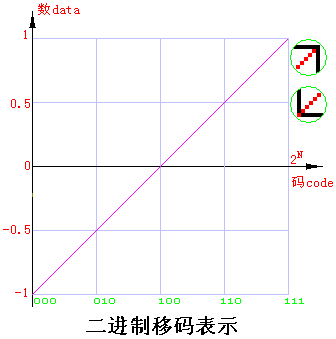
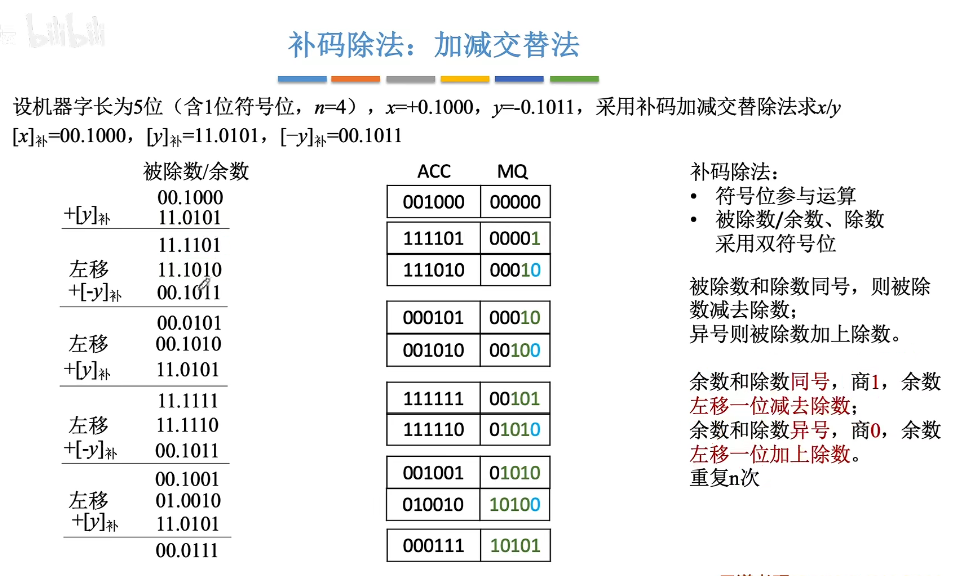
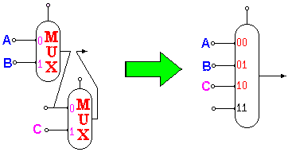
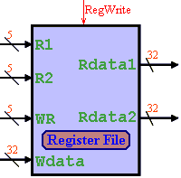
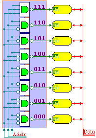
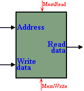
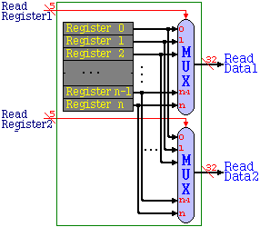
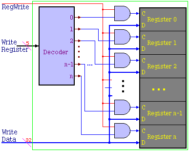
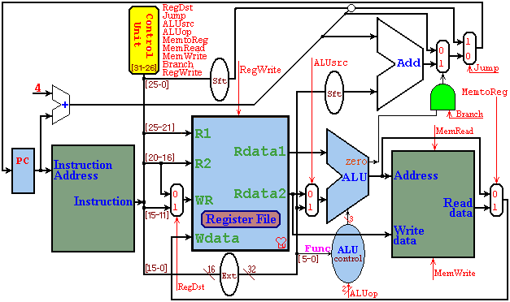

## 前置知识


## 数据表达

### ASCII码与汉字

#### ASCII码

ASCII码（American Standard Code for Information Interchange，美国信息交换标准代码），同时也被国际标准化组织ISO批准为国际标准。是一种使用7个或8个二进制位进行编码的方案。

ASCII码划分为两个集合：

- 128个字符的标准ASCII码
- 附加的128个字符的扩充和ASCII码。

基本的 ASCII 字符集共有 128 个字符，其中有 96 个可打印字符，包括常用的字母、数字、标点符号等，另外还有 32 个控制字符。

标准 ASCII 码是 7 位编码，但由于计算机基本处理单位为字节(1byte = 8bit)，所以一般仍以一个字节来存放一个 ASCII 字符。

每一个字节中多余出来的一位（最高位）在计算机内部通常保持为 0 (在数据传输时可用作奇偶校验位)。

由于标准 ASCII 字符集字符数目有限，在实际应用中往往无法满足要求。为此，国际标准化组织又制定了 **ISO2022 标准**，它规定了在保持与 ISO646 兼容的前提下将 ASCII 字符集扩充为 8 位代码的统一方法。 ISO 陆续制定了一批适用于不同地区的扩充 ASCII 字符集，每种扩充 ASCII 字符集分别可以扩充 128 个字符，这些扩充字符的编码均为高位为 1 的 8 位代码（即十进制数 128~255 ），称为扩展 ASCII 码。

#### 汉字

##### GB2313区位码

GB2313区位码共有87个区，每个区含有94个汉字或者符号

每个区分别存储的信息如下

1. 数字、字母等符号：1～9区，共有682个
2. 10-15区未有编码
3. 一级汉字(按拼音排序)：16～55区，共有3755个
4. 二级汉字(按笔划排序)：56～87区，共有2008个

> 注意：
>
> 1. 一级汉字是常用汉字，二级汉字是非常用汉字，两者的区别在于使用频度
> 2. 并不是每个区中都有94个汉字/符号，有些区并未填满
> 3. 在区位码中，区号和位号都是由两位十进制存储（即00~99）
> 4. 区位码示例：“啊”的区码是16，位码为01，其区位码的十六进制表示为1001H

##### 国标码

汉字的国标码可以在区位码基础上换算得到：国标码=（区位码的十六进制表示）+2020H，国标码的取值范围：2121H～7E7EH

> 例如：“啊”的国标码为1001H+2020H = 3021H

##### 内码(机内码)

中文或西文信息在计算机系统中的代码表示称为机内码。例如ASCII码和GB2312

汉字机内码用连续两个字节表示，为能和ACSII符号区分，每个字节的最高位是1。

机内码和国标码的转换规则是

机内码 = 国标码 + 8080H = 区位码的十六进制表示 + A0A0H。

即，将国标码的两个字节的最高位均置为1。

> 例如：“啊”的内码就是B0A1H，H代表十六进制

##### 外码（汉字输入码）

汉字输入码就是为输入汉字而对汉字编制的代码。由于这种编码是供计算机外部的用户使用的，故又称汉字的外部码

例如：五笔字型、拼音、区位码、电报码...

##### 字模码

字模码是字库中用于存储汉字字模的编码，原理可以理解为点阵编码

> 字模码不是区位码，而是利用了区位码进行相关的计算与定位

以hzk16字库为例

HZK16字库的点阵为16×16，因此表示一个汉字需要256位即32个字节

因为计算机中存储汉字的方式为机内码，且由两个字节表示，而机内码 = 区位码的十六进制 + A0A0H，因此需要先将机内码转化成区位码，转化规则如下

```
区码：汉字的第一个字节 - 0xa0
位码：汉字的第二个字节 - 0xa0
```

则汉字在HZK16中的绝对偏移位置为

```
offset = (94 * (区码 - 1) + (位码 - 1)) * 32
```

> 注意：
>
> 1. 区码和位码减1是因为数组是以0为开始而区号位号是以1为开始的
> 2. (94*(区号-1)+位号-1)是一个汉字字模占用的字节数
> 3. 最后乘以32是因为汉字库文应从该位置起的32字节信息记录该字的字模信息（前面提到一个汉字要有32个字节显示）

通过上面的偏移量，直接利用文件操作即可获取汉字字模，一共32个字节

### 数的进制与转换

#### 进位计数制

进位计数制是用有限的符号(基数)，表示无限的数值的方法。

如十进制就是以十个不同的符号（0到9），表示无穷的数值，因此十进制的基数为十。

符号越多，进位计数制实现越困难。

机器中，常用的状态只有通/断、高/低电平，二种状态，所以用二进制更容易实现。

二进制只需要0、1两个符号，因此二进制的基数为二。

用二进制表示数值，一般位数较多。所以很多时候也用八进制或十六进制。八或十六都是二的整次幂，与二进制换算方便。

数制的一般公式为：

<div style="display:flex;align-items:center;justify-content:center;">
    数 =   
</div>


- R为基数
- a~i~为系数，范围从0到R-1；
- n位整数，
- m位小数。

从十进制到各不同基数数制的转换方法：

1. 整数部分除以基数取余
2. 小数部分乘以基数取整

### 校验码

数据在存储、传输、处理过程中，可能会由于各种原因发生错误，通过在数据中增加一些编码，可以报告或纠正一些错误。校验码可以分成两种：

1. 检错码：能查错，不能纠错
2. 纠错码：可以纠正一定的错误

#### 简单的检错码

- 重复码：通过冗余编码，提高准确度。
- 奇偶校验码

  - 偶校验：每个数据单元中，所有数位(包括校验位)中，1的数目为偶数。
  - 奇校验：每个数据单元中，所有数位(包括校验位)中，1的数目为奇数。
  - 特点：可以检验奇数位错误。代价小。容易实现(将各数位模2加，或异或即可)。
- 恒比码
  - 又称等重码，这种码的码子中1和0的位数保持恒定比例。


#### 纠错码

差错控制编码也称为纠错编码。一般校验码个数为K，2^K^个信息，1个信息用来指出“没有错误”，其余2^K^-1个指出错误发生在那一位，但也可能是校验位错误，故有N≤2^K^-1-K能被校验。

##### 线性分组码

一个[n,k]线性分组码，是把信息划成k个码元为一段（称为信息组），通过编码器变成长度为n个码元的一组，作为[n,k]线性分组码的一个码字。

若每位码元的取值有q种（q为素数幂，q进制），则共有q的k次方个码字。

因此在计算机中，线性分组码[n，k]中可用码字(组)

为2^k^个。

- 加法和乘法

线性分组码的加法为模2和，乘法为二进制乘法。且码字与码字的运算在各个相应比特位上符合上述二进制加法运算规则

> 模2运算规则说明：
>
> - 模2和：相当于“异或”运算。
>
> - 模2减：0－0＝0、0－1＝1、1－0＝1、1－1＝0。
>
> - 模2乘：0×0＝0、0×1＝0、1×0＝0、1×1＝1
>
> - 模2除：0÷1＝0、1÷1＝1

一个[n,k]线性分组码具有如下性质：

1. 封闭性
   - 任意两个码组的和还是可用的码组。

2. 码的最小距离等于非零码的最小码重。

##### 海明码

海明码属于线性分组编码方式，大多数分组码属于线性编码

- 基本原理

使信息码元与 监督码元通过线性方程式联系起来。线性码建立在代数学群论的基础上，各许用码组的集合构成代数学中的群，故又称为群码。

##### CRC循环码

循环码是一种重要的线性码，它有三个主要数学特征：

1. 循环码具有循环性，即循环码中任一码组循环一位(将最右端的码移至左端)以后，仍为该码中的一个码组。
2. 循环码组中任两个码组之和（模2和）必定为该码组集合中的一个码组。
3. 循环码每个码组中，各码元之间还存在一个循环依赖关系

- 生成方法

1. 根据信息的位数，选择生成多项式（这里主要指定生成多项式的位数）
2. 在信息位后补充（生成多项式位数-1）个0，例如下方补充了3个0
3. 以模2减的方式，用第2步中生成的数除以生成多项式
4. 以余数替换原信息位后面补充的0，生成CRC循环校验码

> 生成多项式的构建满足以下条件：
>
> 1. 生成多项式的最高位和最低位必须是1
> 2. 当CRC码任何一位发送错误时，被生成多项式做除后余数不能为0
> 3. 不同位发生错误时，应该使余数不同
> 4. 重复对余数做除时，应该使余数能够循环


- 校验方法

1. 把接收到的单位信息，除以同一生成多项式
2. 如果余数为0，则成功，无错。
3. 否则继续除以生成多项式，并同时将收到的信息循环左移。
4. 当余数为特定值时，将信息位的第一位取反纠错。
5. 继续除以生成多项式，继续循环移位。当余数重新等于最初的余数时，过程结束。

### 逻辑运算（移位运算）

#### 真值表

| **B** | **A** | **A & B** | **A + B** | **A xor B** | **~A** |
| ----- | ----- | --------- | --------- | ----------- | ------ |
| **0** | **0** | **0**     | **0**     | **0**       | **1**  |
| **0** | **1** | **0**     | **1**     | **1**       | **0**  |
| **1** | **0** | **0**     | **1**     | **1**       | **1**  |
| **1** | **1** | **1**     | **1**     | **0**       | **0**  |

> A + B 即 A | B

#### 逻辑移位

逻辑右移：高位补0，低位舍弃

逻辑左移：低位补0，高位舍弃

> 可以把逻辑移位看做是对“无符号数”的算数移位

#### 循环移位

不带进位位：用移出的位补上空缺

带进位位：移出的位放到进位位，原进位位补上空缺

#### 算数移位

<table>
    <tr>
    	<th></th>
        <th>码制</th>
        <th>添补代码</th>
    </tr>
    <tr>
    	<td>正数</td>
        <td>原码、补码、反码</td>
        <td>0</td>
    </tr>
    <tr>
    	<td rowspan=4>负数</td>
        <td>原码</td>
        <td>0</td>
    </tr>
    <tr>
    	<td rowspan=2>补码数</td>
        <td>左移添0</td>
    </tr>
    <tr>
        <td>右移添1</td>
    </tr>
    <tr>
        <td>反码</td>
        <td>1</td>
    </tr>
</table>


### 整数表示

#### 无符号整数表示

A = a~31~2^31^+a~30~2^30^ +a~29~2^29^+...+a~1~2^1^+a~0~2^0^

#### 原码

由符号位加绝对值组成：

X~原~=x，x>=0
X~原~=2^N-1^+|x|，x<0


#### 补码

##### 补码表示

由N位二进制补码所表示的整数：
X~补~ = (2^N^ + x ) mod 2^N^

如果 x >=0：x补 = x；

如果 x <  0：x补 = 2^N^ - |x|；


##### 换算方法

　　x>=0：x补 = x;
　　x<0：
　　　　1、将 x 转换成二进制或十六进制
　　　　2、 二进制：从左到最右边 1 ，按位取反，最右 1 不变。
　　　　　　十六进制：从左到最右非零，以
　　　　　　　　x补 = 0xFFFFFFFG - x　　　　G＝16

##### 符号拓展

下方将把以N位数A的补码A~补N~拓展到M位数A的补码A~补M~

- A>=0

​	A~补M~ = A~补N~	（高位补0）

- A<0

​	A~补M~ = 2^M^ - |A| =  2^M^ -  2^N^ + A~补N~	（高位补1）

##### 溢出判断

> 只有正数+正数才会上溢，即正+正=负
>
> 只有负数+负数才会下溢，即负+负=正

- 采用一位符号位

设A的符号位A~s~，B的符号位B~s~，运算结果S的符号为S~s~，

V=A~s~ B~s~ (!S~s~) + (!A~s~) (!B~s~)S~s~

> 即两个同号的数得到了一个异号的结果就为溢出

#### 移码

##### 移码表示

由符号位加绝对值组成：

X~移~ = 2^N-1^ + x

##### 换算方法

补码最高位取反

x>=0：x移 = x | 2N-1;

x<0：

1. 将 x 转换成二进制或十六进制
2. 二进制
   - 最高位(左1)为0，从左2到最右边 1 ，按位取反，最右 1 不变。
3. 十六进制
   - 从左到最右非零，以x~补~ = 7FFFFFFG - x　　　　G＝16



#### 原码、补码、移码的比较

| 数                 | 原码                            | 补码               | 移码               |
| ------------------ | ------------------------------- | ------------------ | ------------------ |
| 范围               | -127~+127                       | -128~+127          | -128~+127          |
| 最小               | 1111 1111(-127)                 | 1000 0000(-128)    | 1000 0000(-128)    |
| 0                  | 0000 0000(+0)<br/>1000 0000(-0) | 0000 0000          | 1000 0000          |
| 最大(+127)         | 0111 1111                       | 0111 1111          | FFFF FFFF          |
| +1                 | 0000 0001                       | 0000 0001          | 1000 0001          |
| -1                 | 1000 0001                       | 1111 1111          | 0111 1111          |
| N位所能表 示的范围 | -(2^N-1^-1)~+2^N-1^-1           | -2^N-1^~+2^N-1^-1  | -2^N-1^~+2^N-1^-1  |
| 优点               | 直观                            | 加减运算方便       | 大小数、码完全一致 |
| 缺点               | 同号异号，运算麻烦              | 大小比较需单独处理 | 符号位与别的不同   |


#### 四种码的转化规则

- 正数

  补码 = 反码 = 原码

  移码 = 补码符号位取反

- 负数

  反码 = 原码除符号位外的所有位均取反

  补码 = 反码 + 1

  移码 = 补码符号位取反

#### 绝对值与码制的转化

设|A|、[A]~原~、[A]~补~、[A]~移~、[-A]~补~分别为A的绝对值、原码、补码、移码、相反数的补码，其中A为32位数，则有如下关系式

- A大于0

​	A = [A]~原~

​	A = [A]~补~ 

​	A = [A]~移~ ^ 0x80000000

- A小于0

​	|A| = 0x80000000 - [A]~原~

​	|A| = 0xFFFFFFFG(即2^32^) - [A]~补~，符号位直接看补码首位即可

​	|A| = [A]~原~ - 0x80000000

​	|A| = 0x80000000 - [A]~移~，符号位与移码首位相反

> ^符号表示异或运算，加减号即为加减法，如无备注，本文不会用+代替|

### 加法与减法

#### 加法器设计

##### 一位半加器

一个异或门即为一位半加器，因为二者具有相同的真值表

半加器不考虑低位进位来的进位值，只有两个输入，两个输出。由一个与门和异或门构成

计算规则如下：

本位和：`S ＝ A^B`

进　位：`C ＝ A&B`，或`C = AB`

| 被加数A | 加数B | 和数S | 进位数C |
| ------- | ----- | ----- | ------- |
| 0       | 0     | 0     | 0       |
| 0       | 1     | 1     | 0       |
| 1       | 0     | 1     | 0       |
| 1       | 1     | 0     | 1       |

##### 一位全加器

一位全加器可以处理低位进位，并输出本位加法进位

计算规则如下：

本位和：`S ＝ A^B^C` ，此处C为传入的C

进位：`C＝(A^B)&C + A&B`或`C=(A^B)C + AB`或`C＝AB+BC+CA`

> 上方的+表示加法运算，其中最后一个式子溢出部分舍去

| 进位数C~i-1~ | 被加数A~i~ | 加数B~i~ | 和数S~i~ | 进位数C~i~ |
| ------------ | ---------- | -------- | -------- | ---------- |
| 0            | 0          | 0        | 0        | 0          |
| 0            | 0          | 1        | 1        | 0          |
| 0            | 1          | 0        | 1        | 0          |
| 0            | 1          | 1        | 0        | 1          |
| 1            | 0          | 0        | 1        | 0          |
| 1            | 0          | 1        | 0        | 1          |
| 1            | 1          | 0        | 0        | 1          |
| 1            | 1          | 1        | 1        | 1          |

##### 一位全加器与一位半加器的区别

1. 全加器能够处理进位，而半加器不能
2. 两个半加器组成一个全加器

##### 行波进位加法器

将多个一位全加起拼接就成了一个行波进位加法器


行波进位加法器一些名词：

| 简写 | 说明                                           |
| ---- | ---------------------------------------------- |
| OF   | Overflow，溢出，为最高进位与次高进位的异或。   |
| CF   | CarryOut，进位。                               |
| ZF   | zero，当结果为0时，ZF＝1；结果不为0时，ZH＝0。 |
| SF   | 符号位，＜0时为1。                             |
| PF   | 奇偶检验。                                     |

#### 加法器原理

加法器的类型与区别

| 类型                                 | 说明                                                         |
| ------------------------------------ | ------------------------------------------------------------ |
| 完全串行进位                         | 完全串行<br/>每一个进位都依赖于前一进位，设计简单，所需门最少。<br/>但每一位需等到前一位的进位结果，时间最多。 |
| 完全先行进位<br/>(即并行)            | 完全并行<br/>用C0代入C1求C2，依次迭代。所有的计算完全并行进行，无需依赖其它位的运行结果，所需时间最少。<br/>但设计复杂，所需门最多，32位全并行几乎天文数字。 |
| 先行进位<br/>(并行)                  | 基本同上，但先做了g~i~=a~i~b~i~  和p~i~=a~i~+b~i~<br/>使电路简化(所需的门少了)。<br/>但需先花一个时间等p、g结果，所以时间+1 |
| 组内并行<br/>组间串行<br/>(4位1组)   | 分四组。组内采用并行进位。组间采用串行进位。即每一组需等到前一组的运行结果(进位)。 时间为：1个时间算p、g，每组并行2个时间。 |
| 组内并行<br>组间并行<br>分级并行进行 | 分四组，按完全并行进位的公式，每组选择适当的公因子P、G先行计算，以简化公式。总时间=1+2*级 |

> 结论：
>
> 1. 完全串行进位设计最为简单，但所需时间最多。
> 2. 完全并行进位设计所需时间最少，但位数多时所需门也多，电路会非常复杂。
> 3. 为了达到又快又省的目的，可以对完全并行进位的公式，选择适当的公因子(如p、g)先行计算，用结果简化公式(避免重复计算)。
> 4. 对经过简化的公式可以继续选择适当的公因子(如P、G)继续简化，即进行分组或分级。(注意均衡选择公因子)

#### 相反数设计

一个数的相反数为该数取反+1

> 此处进行取反时符号位也要取反

#### 原码加减法

- 加法

正+正	绝对值做加法，结果为正

负+负	绝对值做加法，结果为负

正+负	绝对值大的减绝对值小的，符号位同绝对值大的数

- 减法

将减数的符号取反转变为加法即可

#### 补码加减法

[-B]~补~ = [B]~补~连同符号位一起取反加1

- 加法

[A+B]~补~ = [A]~补~ + [B]~补~

- 减法

[A-B]~补~ = [A]~补~ + [-B]~补~

### 乘法

#### 无符号数乘法

即原码运算的数值部分，详略

#### 原码一位乘法

> 原码乘法中符号位和数值部分分开进行计算，符号位用异或运算即可，数值部分见下


计算步骤：

1. 符号位通过异或确定
2. 数值位由被乘数和乘数的绝对值进行n轮加法
3. 每次加法可能+、+[|x|]~原~
4. 每次移位是逻辑右移
5. 乘数的符号位不参与运算

#### 补码乘法

##### 一位Booth算法（看两位移一位）


计算步骤

1. 符号位、数值位都是由被乘数和乘数进行n轮加法、移位，最后再多来一次加法
2. 每次加法可能+0、+[x]~补~、+[-x]~补~
3. 每次移位都是补码的算数右移
4. 乘数的符号位参与运算

##### 二位Booth算法（**看三位移两位**）


### 除法

#### 原码除法

- 恢复余数法

> 在机器中，原码的除法也是利用补码实现的


- 加减交替法（不恢复除数法）


#### 补码的除法

- 加减交替法



> 被除数与除数同号减，异号加
>
> 除数与余数同号商1，余数左移减除数
>
> 除数与余数异号商0，余数左移加除数
>

### 浮点运算

#### 浮点数表示


**阶码E**：决定浮点数的数值**范围**，用移码表示
**尾数M**：决定浮点数的数值**精度**，用原码表示

浮点数的偏移量为2^E-1^-1

单精度浮点数的E为8位，M为23位，偏移量为127

双精度浮点数的E为1位，M为52位，偏移量为1023

<table border="1" align="center" cellspacing="0" cellpadding="0">
    <tbody><tr align="center"><td colspan="2">单精度浮点数(32位)</td><td colspan="2">双精度浮点数(64位)</td><td rowspan="2">含义</td></tr>
    <tr><td>E:8位</td><td>M:23位</td><td>E:11位</td><td>M:52位</td></tr>
    <tr align="center"><td>0</td><td>0</td><td>0</td><td>0</td><td>0</td></tr>
    <tr align="center"><td>0</td><td>≠0</td><td>0</td><td>≠0</td><td>非规格化浮点数</td></tr>
    <tr align="center">
    <td>1～254</td><td>any</td><td>1～2046</td><td>any</td><td>规格化浮点数</td></tr>
    <tr align="center"><td>255</td><td>0</td><td>2047</td><td>0</td><td>±INF(正负无穷大)</td></tr>
    <tr align="center"><td>255</td><td>≠0</td><td>2047</td><td>≠0</td><td>NaN(not a number)非数</td></tr>
    <tr><td colspan="2">阶码范围：±127</td><td colspan="2">阶码范围：±1023</td><td>浮点数的范围[单:≈10<sup>±38</sup>/双:≈10<sup>±306</sup>]</td></tr>
    <tr><td colspan="2">尾数范围：24位二进制</td><td colspan="2">尾数范围：53位二进制</td><td>浮点数的精度[单:7/双:15位有效位]</td></tr>
    </tbody>
</table>

- 示例(以浮点数-123.4为例)

浮点数：-123.4

1. 转化为二进制数，整数除２取余，小数乘２取整
   - `-1111011.011001100110011001100110011001100110011001101`

2. 将二进制数规格化，即化为形如右侧的格式1.MMMMMM * 2^E-127^
   - `-1.111011011001100110011001100 * 2^6`

3. 按照右侧示例填格式S EEEEEEEE MMMMMMMMMMMMMMMMMMMMMMM
   - `1 10000101 11101101100110011001101`

4. 转化为十六制：
   - `0xC2F6CCCD`	

#### 浮点数的运算

##### 加减运算

- 步骤

1. 对阶
   - 阶数小的向阶数大的靠齐，目的是为了让计算机处理起来更简便，只需将小阶的尾数右移即可
2. 尾数加减
   - 对结果按浮点数标准，调整阶码，对尾数进行四舍五入
3. 规格化
   - 保证尾数是否符合规格化
4. 舍入
   - 舍入的规则可以不一样
5. 判断溢出
   - 阶码溢出才是真正的溢出，尾数溢出并不是溢出

## 指令系统

#### MIPS指令与寄存器

我们主要讲解的是MIPS指令格式，该指令为等长指令，每条指令固定为32位。高6位为操作码，低26位为操作数

| 名称      | 寄存器编号 | 说明                                                         |
| --------- | ---------- | ------------------------------------------------------------ |
| $zero     | 0          | 恒为0                                                        |
| $at       | 1          | 为汇编保留，主要用于伪指令拓展，程序员在自己编程序时不可使用 |
| $v0-\$v1  | 2-3        | 用于保存结果和表达式计算的值，例如子程序返回值               |
| \$a0-\$a3 | 4-7        | 子程序调用参数                                               |
| \$t0-\$t7 | 8-15       | 临时变量寄存器                                               |
| \$s0-\$s7 | 16-23      | 变量寄存器                                                   |
| \$t8-\$t9 | 24-25      | 更多的临时变量                                               |
| \$k0-\$k1 | 26-27      | 保留供操作系统内核使用&异常返回                              |
| $gp       | 28         | 全局指针                                                     |
| $sp       | 29         | 堆栈指针，指向堆栈顶部的的低地址                             |
| $fp       | 30         | 帧指针，指向帧内固定地址的指针                               |
| $ra       | 31         | 返回地址寄存器，在调子程序时保存返回地址                     |

> \$t：主调保存寄存器，由主程序负责寄存器的数据安全。即在子程序中可以随便使用，如果寄存器内容的改变可能影响程序运行，由主程序负责将寄存器内容存入堆栈，在子程序返回时出栈恢复。 
>
> \$s：被调保存寄存器，由子程序负责寄存器的数据安全。即在子程序中如果需要改变寄存器内容，则必须在改变之前将寄存器内容存入堆栈保存，在返回主程序之前恢复寄存器内容。 
>
> \$a：子程序调用参数寄存器，按顺序将调用参数存放在寄存器中，在子程序中使用。\$a 也用于 系统功能调用的参数。 
>
> \$v：子程序返回参数寄存器。 
>
> \$sp：堆栈指针。 
>
> \$at：只作为汇编器进行程序汇编时，为伪指令扩展之用，程序员在自己编程序时不可使用。

### 操作码与操作数

#### 指令编码格式

MIPS指令根据其编码格式分为四组：

- R-Type
  - 包含**不需要**立即数（immediate value）、目标偏移量（target offset）、内存地址位移（memory address displacement）或内存地址来指定操作数的所有指令
  - 该指令可以指定最多3个寄存器和偏移量
  - 包括寄存器中所有操作数的算术和逻辑、移位指令和寄存器直接跳转指令、jalr、jr
  - 所有 R 类型指令都使用操作码 000000
  - 要求至少记住ADD、SUB、AND、OR、SLT指令的格式

- I-Type
  - I指令包括具有立即操作数（immediate operand）的指令、分支指令以及加载和存储指令
  - I 型指令具有一个 16 位立即字段，用于编码内存操作数的即时操作数、分支目标偏移量或内存操作位移
  - 在 MIPS 架构中，所有内存访问都由主处理器处理，因此协处理器（coprocessor）加载和存储指令都包含在此组中
  - 除 000000、00001x 和 0100xx 之外的所有操作码都用于 I 型指令
  - 要求至少记住LW、SW、BEQ指令的格式

- J-Type
  - 此组由两个直接跳转指令（j和jal）组成
  - 该指令需要一个26位的被编码的地址字段来指定其跳转目标
    - 该26位地址字段由实际地址表示的二进制中位置从27到2的位构成。实际地址中的位置1和0处的位始终为0，因为指令是字对齐的
    - 当执行J型指令时，通过连接PC的高阶四位（跳转后的指令地址），目标字段的26位和两个0位，形成一个完整的32位跳转目标地址
  - J 型指令使用操作码 00001x
  - 要求至少记住J指令的格式

- 协处理器指令

  - MIPS 处理器都有两个标准协处理器 CP0 和 CP1
    - CP0 用于处理各种程序异常
    - CP1 是浮点处理器
    - MIPS架构允许将来包含两个额外的协处理器，CP2和CP3。

  - 大多数浮点指令使用格式字段来指定数字编码格式

    - 单精度 （.s）
    - 双精度 （.d）
    - 定点 （.w）

  - 所有协处理器指令都使用操作码 0100xx

  - 示例

    - > add.s	fd, fs, ft	000000	10000
      > cvt.s.w	fd, fs, ft	100000	10100
      > cvt.w.s	fd, fs, ft	100100	10000
      > div.s	fd, fs, ft	000011	10000
      > mfc1	ft, fs	000000	00000
      > mov.s	fd, fs	000110	10000
      > mtc1	ft, fs	000000	00100
      > mul.s	fd, fs, ft	000010	10000
      > sub.s	fd, fs, ft	000001	10000


- Pseudo Instructions

  - MIPS中有一种叫伪指令 ， 这种指令并没有真正在硬件中实现，也就没有对应的机器码

- 系统调用（syscall）

| **Service**  | **SystemCallCode($v0)** | **Arguments**（参数）                        | **Result**            |
| ------------ | ----------------------- | -------------------------------------------- | --------------------- |
| print_int    | 1                       | $a0=integer                                  | --                    |
| print_float  | 2                       | $f12=float                                   | --                    |
| print_double | 3                       | $f12=double                                  | --                    |
| print_string | 4                       | $a0=string                                   | --                    |
| read_int     | 5                       | --                                           | $v0=integer           |
| read_float   | 6                       | --                                           | $f0=float             |
| read_double  | 7                       | --                                           | $f0=double            |
| read_string  | 8                       | \$a0=buffer \$a1=length                      | --                    |
| sbrk         | 9                       | $a0=amount                                   | --                    |
| exit         | 10                      | --                                           | --                    |
| print_char   | 11                      | $a0=char                                     | --                    |
| read_char    | 12                      | --                                           | $a0=char              |
| open         | 13                      | \$a0=filename \$a1=flags \$a2=mode           | $a0=file descriptor   |
| read         | 14                      | \$a0=file descriptor \$a1=buffer \$a2=length | $a0=num chars written |
| write        | 15                      | \$a0=file descriptor \$a1=buffer \$a2=length | $a0=num chars written |
| close        | 16                      | $a0=file descriptor                          | --                    |
| exit2        | 17                      | $a0=result                                   | --                    |

### MIPS指令集

#### MIPS寻址方式

寻址即是在指令中，指示操作数所在位置的方式。操作数的位置有三种：

- 指令中
  - 即操作数就是所执行的指令中的立即数
- 寄存器
  - 操作数在通用寄存器里。
- 存储器
  - 操作数在内存中


### 伪指令（PseudoInstruction）

伪指令相当于x86里的宏。
有些指令不是很常用，没必要以硬件实现。可以通过现有指令的简单组合来完成指令功能，汇编时将其转换成一条或几条现有指令。
伪指令没有自己的操作码。

| 伪指令             | 功能                    | 真指令                                                      | 备注                                         |
| ------------------ | ----------------------- | ----------------------------------------------------------- | -------------------------------------------- |
| MOVE \$rd, \$rs    | \$rd=\$rs               | ADD \$rd, \$rs, \$zero                                      | SUB \$rd, \$rs, \$zero OR \$rd, \$rs, \$zero |
| BLT \$rs, \$rt, RR | if(\$rs < \$rt)goto RR  | SLT \$at, \$rs, \$rt BNE \$at, $zero, RR                    |                                              |
| BGT \$rs, \$rt, RR | if(\$rs > \$rt)goto RR  | SLT \$at, \$rt, \$rs BNE \$at, $zero, RR                    |                                              |
| BLE \$rs, \$rt, RR | if(\$rs <= \$rt)goto RR | SLT \$at, \$rt, \$rs BEQ \$at, \$zero, RR                   |                                              |
| BGE \$rs, \$rt, RR | if(\$rs >= \$rt)goto RR | SLT \$at, \$rs, \$rt BEQ \$at, \$zero, RR                   |                                              |
| ABS \$rd, \$rs     | \$rd = \|\$rs\|         | SRA \$at, \$rs, 31 XOR $rd, \$rs, \$at SUB \$rd, \$rs, \$at |                                              |

### **格式指令**

#### MIPS参考格式指令

| 序   | 名      | 类   | 格式                | 说明                           | 备注                                 |
| ---- | ------- | ---- | ------------------- | ------------------------------ | ------------------------------------ |
| 0    | --      | --   | --                  | --                             | --                                   |
| 0    | equ     | --   | XXX equ xxxx        | 定义符号常数。                 | 类似C语言：#define                   |
| 1    | .align  | 地址 | .align n            | 地址按2的n幂对齐。             | 强制变量或程序在内存中对齐           |
| 2    | .origin | 地址 | .origin addr        | addr：当前起始地址             | 随后的变量或程序被加载到内存指定地址 |
| 3    | .data   | 格式 |                     | 数据须                         |                                      |
| 4    | .end    | 格式 | .end L              | 程序结束，从L处执行            |                                      |
| 5    | .text   | 格式 |                     | 代码段                         |                                      |
| 6    | dup     | 前缀 |                     | 重复前缀：n dup (..)           | 将(..)内容在内存中重复n遍，可以嵌套  |
| 0    | --      | --   | --                  | --                             | --                                   |
| 7    | .2byte  | 数据 | 变量 .2byte <表>    | 2byte变量，变量为起始地址      |                                      |
| 7    | .zjie   | 数据 | 变量 .zjie <表>     | 16-bit字节变量，变量为起始地址 |                                      |
| 8    | .4byte  | 数据 | 变量 .4byte <表>    | 4byte变量，变量为起始地址      |                                      |
| 9    | .8byte  | 数据 | 变量 .8byte <表>    | 8byte变量，变量为起始地址      |                                      |
| 10   | .ascii  | 数据 | 变量 .ascii "<表>"  | ascii字符串变量                |                                      |
| 11   | .asciiz | 数据 | 变量 .asciiz "<表>" | 0结束ascii字符串变量           | C字符串标准                          |
| 12   | .byte   | 数据 | 变量 .byte <表>     | byte变量，变量为起始地址       |                                      |
| 13   | .double | 数据 | 变量 .double <表>   | 双精度变量                     |                                      |
| 14   | .dword  | 数据 | 变量 .dword <表>    | 双字变量                       | 8byte                                |
| 15   | .file   | 数据 | 变量 .file          | 文件变量                       |                                      |
| 16   | .float  | 数据 | 变量 .float <表>    | 单精度浮点数变量               |                                      |
| 17   | .half   | 数据 | 变量 .half <表>     | 半字变量                       | 2byte                                |
| 18   | .space  | 数据 | 变量 .space n       | nbyte空间                      |                                      |
| 19   | .word   | 数据 | 变量 .word <表>     | 字变量                         | 4byte                                |

#### MIPS汇编表达式运算符

| 序   | 运算符 | 说明     |
| ---- | ------ | -------- |
| 1    | +      | 加       |
| 2    | -      | 减       |
| 3    | *      | 乘       |
| 4    | /      | 除       |
| 5    | %      | 取余     |
| 6    | ~      | 非       |
| 7    | &      | 与       |
| 8    | \|     | 或       |
| 9    | ^      | 异或     |
| 10   | <<     | 左移     |
| 11   | >>     | 右移     |
| 12   | >>>    | 算术右移 |
| 13   | high   | 高16位   |
| 14   | low    | 低16位   |
| 15   | (      | 左括     |
| 16   | )      | 右括     |

## CPU设计

### **数据通道设计**

#### 设计思路

- 机器指令一般格式为

  - 操作码和0~3个操作数

  - 这种格式便于硬件的理解与操作实现。

- 计算机指令集根据其指令特点一般分为
  - 复杂指令系统CISC
    - CISC的指令一般比较复杂，单条指令的功能更为强大，执行的时间也较长
    - 对于存储器的寻址有更多的方式，可以直接从存储器中取数运算，或将运算结果直接写入存储器
    - 指令的长度根据功能变化，长短不一　
  - 精简指令系统RISC
    - RISC的指令一般比较整齐，单条指令的功能单一，执行时间比较快
    - 只能对寄存器中的数据运算，存储器的寻址一般只能通过L/S(Load/Store)进行
    - 一般为等长指令，更便于流水线
- MIPS为RISC系统，采用等长指令，每条指令4个字节
  - 每条指令都有相同的长度：32位
  - 操作码固定为：6位
  - 其余26位为若干个操作数
- 指令指针PC
  - 指令指针PC是一个独立的寄存器
  - 所有的指令都是预先存放在只读的指令存储器中，我们用指令指针**PC**保存当前执行的指令在指令存储器中的地址
  - PC的内容总是指向下一条将要执行的指令地址
  - 程序一般顺序执行，每次取指令后，PC都自动加4，以指向下一条指令
  - 只有当执行转移时，PC才会根据指令的执行改变内容
- 单时钟CPU设计
  - 指令的执行由时钟触发，每个时钟内CPU执行一条指令
  - 指令存放在指令存储器中，数据存放在数据存储器中
  - 每个组件在一条指令的执行中，只完成一项任务
  - 存储器只有一个地址端，一次只能读出或写入一个数据

- 寄存器组(Register File)
  - 由于一条指令一般都需2到3个操作，所以需要一个多端口的存储元件，可以在一个时钟内，进行多路的读出数据，并同时可以写入数据，这个元件就是寄存器组
  - 寄存器的数量很少(本设计中为32个32位寄存器)，数据总是先通过LW指令，从内存中读到寄存器中，运算后，再用SW写到存储器中

- 状态元件

  - 存储器与寄存器都是状态元件，状态元件可以保存当前的数据，并在必要时读出
  - 访问多个状态元件的集合(存储器或寄存器组)时，需指定所要访问的单元，即地址
  - 状态元件内容的改变一般需要控制。状态元件的输入与输出定义在一个时钟的不同阶段，先读后写。所以其读出的内容都是上个时钟以前写入的数据，而当前时钟写入的数据，**只有**在以后的时钟才能读出

- 组合逻辑元件

  - ALU为组合逻辑元件，组合逻辑元件的输出完全取决于当前的输入数据，通过其本身的逻辑关系产生输出数据

- 设计的四原则

  -  简单规则

  - 越小越快
  - 好的设计需要相互妥协
  - 使常用的快速运行。

### 基本组件设计

#### 基本组件

- 逻辑门

  - CPU的逻辑设计以逻辑门为基础，常用的逻辑门有

    - AND 与门

    - OR 或门

    - NOT 非门

    - XOR 异或门

    - NOR 或非门

  - 这些门一般的逻辑设计均作为基本元件提供
  - 由这些逻辑门可以组成简单的组合逻辑组件
    - 多路选择器MUX
    - 译码器
    - ALU
    - 等等

- 状态元件
  - 状态元件包括
    - 寄存器
    - 存储器
    - 寄存器组
  - 有些直接由线路连接即可完成
    - 16到32位符号扩展
    - 固定左移2位元件
    - 等等

> 由于我们所设计的MIPS为32位CPU，所以组件一般都以**32位数据操作**，个别还需有考虑5位等不同位数的数据。

- CPU设计过程
  - 简单来说CPU设计是不断地打包的过程
    - 设计基本组件
    - 牢记基本组件的功能与输入输出间的关系
    - 利用基本组件设计更复杂的组件
    - 重复以上过程直到CPU设计完成

#### 逻辑门

> 真值表内容忽略

| 逻辑与：AND       |  |
| ----------------- | --------------------------------------------------------- |
| **逻辑或：OR**    |   |
| **逻辑非：NOT**   |  |
| **逻辑异或：XOR** |  |

> 以上的简单逻辑门均还需考虑多位或多路数据的逻辑运算，例如二路或多路32位的逻辑运算

#### 逻辑组合组件

##### 译码器（Decode）

译码器实现的功能为当给出一组输入时，所有输出端只有一个与其它所有的输出端不同

译码器可用于地址选择，众多单元都接在电路中，根据地址却只有一个单元被唯一选中。

如果元件有N个输入端，有2^N^个输出端，则称为完全译码

- 二四译码器


- 三八译码器

当给出三个输入时，八个输出端只有一个与其它所有的输出端不同


##### 多路选择器（MUX）

元件有多个数据输入，却只允许有一个数据输出。通过控制信号，决定哪一个输入连接到输出端。

在电路设计中，一个信号可以输出到许多地方，但许多数据想连接到一个输入端则必须通过多路选择器，由控制信号决定哪一路输入。


可以将两个二选一合并为一个四选一



##### 移位

- 实现固定移位
  - 通过输入输出连线的错位实现

- 实现可变移位
  1. 可以使用移位寄存器，通过时钟逐步移位
  2. 也可以通过多路选择器，直接实现移位操作
     - 通过多路选择器直接实现实际是利用空间换时间，利用复杂的设计，提高移位速度


##### 符号扩展

对于有符号的补码数进行扩展，其正数与负数的扩展方式不同

对于补码的扩展可以通过重复符号位(最高位)的方式实现

对于无符号数的扩展只要将高位清零即可。


### 状态元件

#### 寄存器单元

状态元件的输出不同于组合逻辑，组合逻辑的输出只与当前的输入有关。而状态元件的输出还与本身的状态有关。一般输出输入有一个时钟的延时。


### 整数的加减运算

目前的计算机并不能进行任何算术运算，只能进行逻辑运算。因此，算术运算必须以某种等效的逻辑运算代替。先看两个一位数加数的真值表

不考虑进位的加法，称为半加(half-add)

由表B-6可见，不考虑进位的一位加法，与异或运算的真值完全一致。即可以用异或门执行一位加法运算

因此，异或就是一个一位的半加器

对于A-B相当于A+(-B)，而(-B)的补码是B的反码加1。为此，我们设定mode信号控制加减运算选择，并将mode控制与B异或

当执行加法时，mode=0，B与0异或仍为B，C0=0

当执行减法时，mode=1，B与1异或相当于B取反，C0=1，正好如B的反码加1


### 复杂模块

#### ALU和ALU控制器

##### ALU

算术逻辑单元ALU负责算术逻辑运算，是CPU中最重要的运算部件。
逻辑运算包括逻辑与、逻辑或。
算术运算有加法、减法。
还有SLT。

32位算术逻辑运算单元ALU：

由于能执行五种操作，所以控制信号至少为3位

 

| Operation | Function |
| --------- | -------- |
| 000       | And      |
| 001       | Or       |
| 010       | Add      |
| 110       | Sub      |
| 111       | Slt      |


##### ALU控制器

为了使常用的运算(+、-)能更便于控制，为ALU设计了ALU控制器


| ALUop | Function field | ALU  |      |      |      |      |      |           |          |
| ----- | -------------- | ---- | ---- | ---- | ---- | ---- | ---- | --------- | -------- |
| op1   | op0            | F5   | F4   | F3   | F2   | F1   | F0   | Operation | Function |
| 0     | 0              | x    | x    | x    | x    | x    | x    | 010       | Add      |
| 0     | 1              | x    | x    | x    | x    | x    | x    | 110       | Sub      |
| 1     | x              | x    | x    | 0    | 0    | 0    | 0    | 010       | Add      |
| 1     | x              | x    | x    | 0    | 0    | 1    | 0    | 110       | Sub      |
| 1     | x              | x    | x    | 0    | 1    | 0    | 0    | 000       | And      |
| 1     | x              | x    | x    | 0    | 1    | 0    | 1    | 001       | Or       |
| 1     | x              | x    | x    | 1    | 0    | 1    | 0    | 111       | SLT      |


#### 存储器

存储器即为多个寄存器的集合，由译码器选择指定的寄存器单元(即地址)

存储器分为只读存储器与读写存储器。

存储器按字节编址，MIPS采用32位地址线，可寻址空间为2^32^=4GB。数据线也采用32位。 　

将多个存储单元通过译码器，组合成一个存储器，由译码器提供地址选择。当给出一组地址时，只有唯一的一个存储被选中






##### 指令存储器

为ROM只读存储器，只能按地址读取存储器内容


##### 数据存储器

为RAM读写存储器：根据读写控制信号，一次可以读或写入一个32位数据，读写共用一个地址输入端，读写数据分别与存储器连接。



#### 寄存器组

由于指令一般都有2～3个操作数，为此特地设计了可以多路同时读写的存储器----寄存器组

寄存器组是CPU的主要部件，可同时进行二路读，和一路写操作。

寄存器组共有32个32位的寄存器，其编号从0～31，用5位二进制寻址

> 这32位寄存器即MIPS中的32个寄存器，作用相同

##### 寄存器组读逻辑

32个32位存储单元，由两路5位寄存器地址选择读出寄存器内容。



##### 寄存器组写逻辑

由5位地址选择写入的寄存器，数据端为32位。
RegWrite作为写入允许控制。



### 单时钟CPU设计



| **控制信号** | **R类型** | **LW** | **SW** | **BEQ** |      |      |
| ------------ | --------- | ------ | ------ | ------- | ---- | ---- |
| RegDst       | 1         | 0      | ×      | ×       |      |      |
| ALUsrc       | 0         | 1      | 1      | 0       |      |      |
| ALUop        | 10        | 00     | 00     | 01      |      |      |
| MemtoReg     | 0         | 1      | ×      | ×       |      |      |
| RegWrite     | 1         | 1      | 0      | 0       |      |      |
| MemRead      | 0         | 1      | 0      | 0       |      |      |
| MemWrite     | 0         | 0      | 1      | 0       |      |      |
| Branch       | 0         | 0      | 0      | 1       |      |      |

> 此处的控制信号的写法仅供参考，除ALUop外的控制信号均可以根据实际需要进行调整
